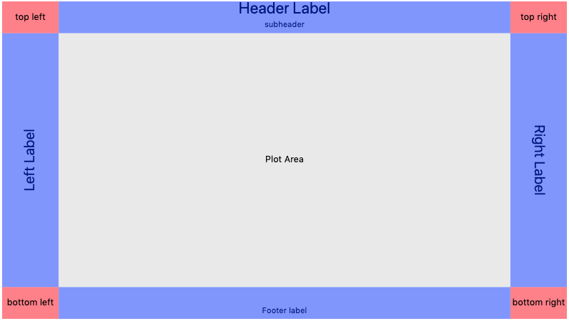

## D3 Chart Layouts

This is a non backwards compatible rewrite of the [D3 Abstraction Classes](https://github.com/fuzzyray/d3-abstraction-classes) 
that I wrote for my freeCodeCamp Data Visualization projects. Looking at the code, I decided that it would be better to 
rewrite from scratch.

The layout that the class provides is shown below:

License: MIT